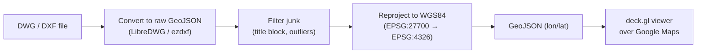
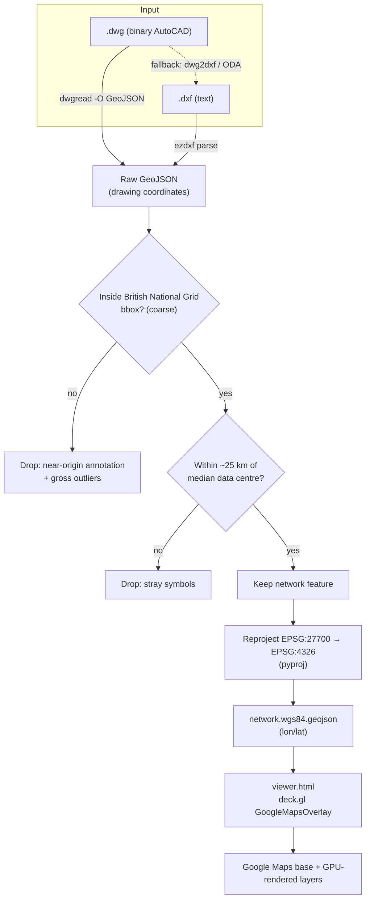
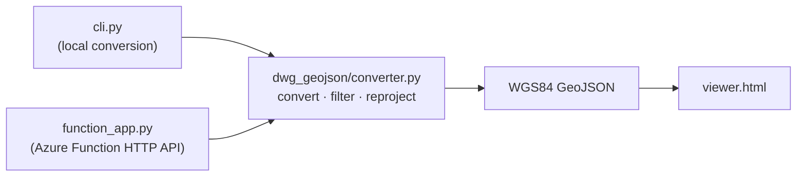
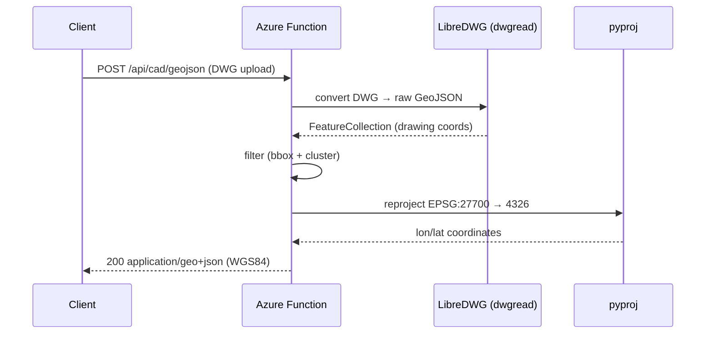

# DWG → GeoJSON → Google Maps — Flow

This document describes how a CAD drawing (`.dwg` / `.dxf`) is turned into
map-ready GeoJSON and rendered on Google Maps.

## High-level flow



## Libraries & packages used

### Converting (DWG/DXF → GeoJSON, in WGS84)

| Package / tool | Version | Type | Role in the flow |
| -------------- | ------- | ---- | ---------------- |
| **LibreDWG** (`dwgread`, `dwg2dxf`) | 0.13.3 | System binary (C, GPL) | Reads the proprietary binary **DWG**. `dwgread -O GeoJSON` exports geometry natively; `dwg2dxf` is the DXF fallback. Installed via `brew install libredwg` / `apt-get install libredwg-tools`. |
| **ezdxf** | 1.4.2 | Python (pip) | Parses **DXF** files (and the DWG→DXF fallback) into entities, with tolerant `recover` mode for non-conforming DXF. |
| **pyproj** | 3.6.1 | Python (pip) | Coordinate reprojection **EPSG:27700 (British National Grid) → EPSG:4326 (WGS84 lon/lat)**. Wraps the PROJ library. |
| **azure-functions** | 1.24.0 | Python (pip) | Hosts the HTTP API (`POST /api/cad/geojson`) on Azure Functions (Python v2 model). |
| Python stdlib (`subprocess`, `json`, `tempfile`, `math`) | 3.9+ | Built-in | Invokes LibreDWG, parses/serializes JSON, samples arcs/circles, manages temp files. |

> The pip packages are pinned in `requirements.txt`. LibreDWG is an external
> system dependency (not pip-installable) — bundled via the `Dockerfile` for
> cloud deployment.

### Mapping (GeoJSON → interactive map)

| Library | Version | Type | Role in the flow |
| ------- | ------- | ---- | ---------------- |
| **Google Maps JavaScript API** | `v=weekly` | JS (CDN) | The base map (street / hybrid / satellite tiles) and camera. Loaded with your API key. |
| **deck.gl** | 9.0.0 | JS (CDN, `unpkg`) | GPU-accelerated rendering of ~42k+ features. `GoogleMapsOverlay` syncs a deck.gl `GeoJsonLayer` with the Google Maps camera. |
| `@deck.gl/google-maps` `GoogleMapsOverlay` | (in deck.gl 9.0.0 bundle) | JS | Bridges deck.gl layers onto the Google Maps instance. |
| `deck.gl` `GeoJsonLayer` | (in deck.gl 9.0.0 bundle) | JS | Draws the lines/polygons/points, colored per CAD layer, with hover picking (lat/lng tooltip). |

> deck.gl is used instead of the native Google Maps `Data` layer because the
> Data layer cannot handle tens of thousands of features smoothly; deck.gl
> renders them on the GPU.

## Detailed pipeline



## Why each step exists

| Step | Why |
| ---- | --- |
| **DWG → GeoJSON** | DWG is a proprietary binary format. LibreDWG's `dwgread -O GeoJSON` reads it natively; `ezdxf` handles `.dxf`. |
| **Filter** | The drawing mixes the real asset network (in real-world coordinates) with a title block / legend drawn near the local origin and a few degenerate outliers. A coarse BNG bbox + a 25 km cluster-radius filter keeps only the network. |
| **Reproject** | CAD coordinates are **British National Grid eastings/northings (EPSG:27700)**, not longitude/latitude. Google Maps needs **WGS84 (EPSG:4326)**. `pyproj` performs the transform. |
| **Viewer** | ~42k features overwhelm the native Google Maps Data layer, so [deck.gl](https://deck.gl/) renders them on the GPU over a Google Maps base. |

## Georeferencing (how we know the CRS)

The source DWG carries an `AcDbGeoData` object and a header geo-location:

- Reference latitude / longitude: **52.0544, -0.7089** (Bedfordshire, UK)
- Coordinate system: **EPSG:27700** (British National Grid), units = metres

The feature coordinates fall in BNG range (easting ≈ 485,000–490,000 m,
northing ≈ 240,000–280,000 m) and reproject back to the reference point,
confirming the CRS.

> For drawings in a different region/CRS, pass `--source-epsg <code>`
> (CLI) or `?sourceEpsg=<code>` (API).

## Components



| File | Role |
| ---- | ---- |
| `dwg_geojson/converter.py` | Core: DWG/DXF → GeoJSON, bbox + cluster filter, WGS84 reprojection |
| `cli.py` | Command-line entry point |
| `function_app.py` | Azure Functions v2 HTTP endpoint `POST /api/cad/geojson` |
| `viewer.html` | deck.gl-over-Google-Maps viewer |
| `Dockerfile` | Custom Functions image bundling LibreDWG for cloud deployment |

## Sequence: API request



## How to run

### A. View the map (data already converted)

```bash
cd ESP.DocumentExtractor.Python
source .venv/bin/activate
python -m http.server 8000
# open http://localhost:8000/viewer.html
```

### B. Convert a DWG, then view

```bash
cd ESP.DocumentExtractor.Python
source .venv/bin/activate
python cli.py "/path/to/file.dwg" --wgs84 --filter -o sample_output/network.wgs84.geojson
# refresh the browser, or use the file picker in the viewer
```

> `.dwg` input requires LibreDWG: `brew install libredwg` (macOS) or
> `apt-get install libredwg-tools` (Debian/Ubuntu).

### C. Run the Azure Function API

```bash
cd ESP.DocumentExtractor.Python
source .venv/bin/activate
pip install -r requirements.txt
func start
# POST http://localhost:7071/api/cad/geojson
```

## Conversion options

| CLI | API query | Effect |
| --- | --------- | ------ |
| `--wgs84` | `?reproject=true` | reproject to WGS84 lon/lat |
| `--filter` | `?filter=true` | keep only the network cluster |
| `--source-epsg N` | `?sourceEpsg=N` | source CRS (default 27700) |

## Result (sample)

The provided sample drawing reduces from **~172,937 raw features** to
**~42,543 real network features** after filtering, all reprojected to WGS84 and
centered near **lat 52.05, lon -0.71**.
