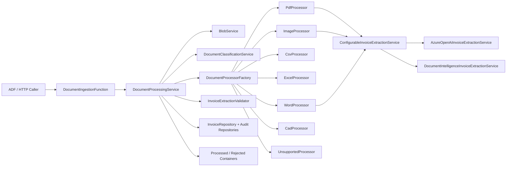

# ESP.DocumentExtractor Architecture

`ESP.DocumentExtractor` is split into four runtime layers:

- `FunctionApp`: HTTP entrypoint, configuration bootstrap, dependency injection, and worker host setup.
- `Application`: orchestration, validation, classification, processor factory, and processor abstractions.
- `Domain`: entities, enums, exceptions, and the result pattern.
- `Infrastructure`: Azure Blob access, Azure OpenAI and Document Intelligence integrations, Dapper repositories, retry execution, and SQL scripts.

## Design Decisions

- Clean architecture: the function is an input adapter only, while orchestration lives in `DocumentProcessingService`.
- Strategy pattern: every document type is handled by an `IDocumentProcessor` implementation, resolved through `DocumentProcessorFactory`.
- Repository pattern: SQL persistence is isolated behind `IInvoiceRepository`, `IProcessingAuditRepository`, and `IBlobProcessingHistoryRepository`.
- Result pattern: orchestration and processors use `Result<T>` to avoid exception-driven control flow.
- Options pattern: storage, blob, SQL, retry, Azure OpenAI, and Document Intelligence settings are bound through typed options.
- Resilience: external calls route through `IRetryPolicyExecutor` with exponential backoff.
- Observability: structured logs include correlation id, blob name, document type, status, and execution timing.

## Processing Sequence

1. A caller posts a `DocumentProcessingRequest` to the Function endpoint.
2. `DocumentIngestionFunction` validates the request and forwards it to `DocumentProcessingService`.
3. `DocumentProcessingService` downloads the blob and classifies the document type.
4. `DocumentProcessorFactory` resolves the correct processor.
5. The processor extracts invoice data through:
   - `ConfigurableInvoiceExtractionService`, which routes PDF, image, screenshot, and Word to either `AzureOpenAiInvoiceExtractionService` or `DocumentIntelligenceInvoiceExtractionService` based on `DocumentProcessingRequest.ExtractionMode`.
   - `CsvProcessor` for CSV.
   - `ExcelProcessor` for workbook input.
   - `CadProcessor` for extensibility-safe CAD handling.
6. `InvoiceExtractionValidator` validates required business fields.
7. `InvoiceRepository` persists header and line items in a single SQL transaction.
8. Audit and blob history records are saved.
9. The blob is moved to `processed` or `rejected`.
10. Raw provider payloads are archived under `rawresponses`.

## Mermaid

