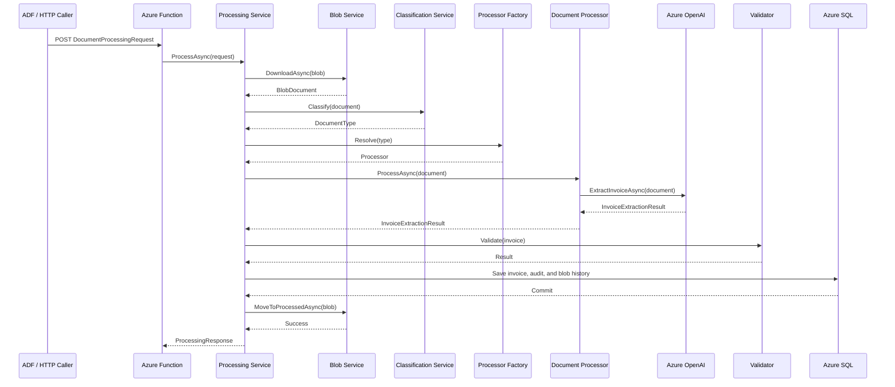

```mermaid
sequenceDiagram
    participant ADF as ADF / HTTP Caller
    participant FN as Azure Function
    participant ORCH as Processing Service
    participant BLOB as Blob Service
    participant CLS as Classification Service
    participant FAC as Processor Factory
    participant PROC as Document Processor
    participant AOAI as Azure OpenAI
    participant VAL as Validator
    participant SQL as Azure SQL

    ADF->>FN: POST DocumentProcessingRequest
    FN->>ORCH: ProcessAsync(request)
    ORCH->>BLOB: DownloadAsync(blob)
    BLOB-->>ORCH: BlobDocument
    ORCH->>CLS: Classify(document)
    CLS-->>ORCH: DocumentType
    ORCH->>FAC: Resolve(type)
    FAC-->>ORCH: Processor
    ORCH->>PROC: ProcessAsync(document)
    PROC->>AOAI: ExtractInvoiceAsync(document)
    AOAI-->>PROC: InvoiceExtractionResult
    PROC-->>ORCH: InvoiceExtractionResult
    ORCH->>VAL: Validate(invoice)
    VAL-->>ORCH: Result
    ORCH->>SQL: Save invoice, audit, and blob history
    SQL-->>ORCH: Commit
    ORCH->>BLOB: MoveToProcessedAsync(blob)
    BLOB-->>ORCH: Success
    ORCH-->>FN: ProcessingResponse
```
